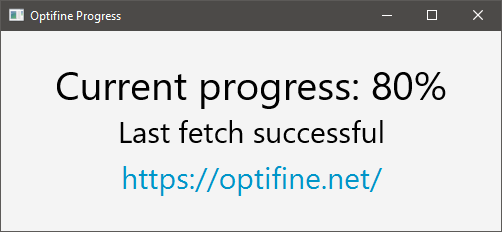

# Optifine Progress Updater

This is a very simple application written in Kotlin using [TornadoFX](https://github.com/edvin/tornadofx) and [Kodein](https://github.com/Kodein-Framework/Kodein-DI/). It provides a simple GUI that displays the current progress of porting Optifine, a Minecraft Mod, to Minecraft 1.13. It acts merely as an example to show how Kotlin and the Frameworks mentioned above work.

## Screenshot

## Remarks

It will probably not work anymore after some time, because Optifine's website https://optifine.net/ obviously will not stay the same forever.
